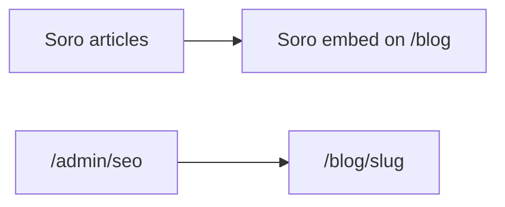

# Soro SEO + Hostora blog

How [Soro](https://trysoro.com/) appears on this Next.js site.

**Soro’s product path here is Embed only** (no webhook in their Connect UI). Hostora still owns `/admin/seo` and `/blog/[slug]` for first-party posts.

## How it works

| Piece | Role |
|-------|------|
| `/blog` | Hostora hero + **Soro embed widget** + “Hostora notes” list |
| `/blog/[slug]` | Native Hostora articles (admin / CLI / seed) + JSON-LD |
| `/admin/seo` | Hostora draft → approve → Blob publish |
| `POST /api/blog/publish` | Hostora tools only — **not** used by Soro embed |



## Connect Soro (embed)

1. Copy the embed ID from Soro → Settings → Connect → Embed (script URL ends with `/api/embed/<id>`).
2. Set on Vercel Production (and `.env.local`) then redeploy:

```bash
NEXT_PUBLIC_SORO_EMBED_ID=f4209b93-9cbd-4ae4-b286-ded667a515ef
```

Hostora falls back to that Production ID if the env is unset.

3. Open `https://www.hostorasoft.co.uk/blog` and confirm the widget mounts (`#soro-blog`).
4. In Soro, click **I’ve Added the Code**.
5. Prefer **approve then publish** inside Soro (avoid blind auto-publish).

### Limitations

- Article chrome and deep links (`/blog?post=<slug>`) are **Soro-controlled**.
- Hostora **cannot** brand-lint embed body HTML the way `/admin/seo` or `/api/blog/publish` does.
- Paste brand voice into Soro anyway (below).

### Share previews (Open Graph)

Soro share links look like `/blog?post=restaurant-pos-software` (not `/blog/[slug]`). WhatsApp and similar crawlers only see **server** meta tags.

Hostora reads article title, excerpt, and featured image from Soro’s embed script (`SORO_ARTICLES`) and sets `og:title` / `og:image` for that `?post=` URL so shares show the article photo instead of the default Hostora OG card.

After publishing a new Soro post, re-share or refresh the link preview once the site has redeployed / cache has updated (embed metadata is revalidated every ~2 minutes).

## Brand guardrails (paste into Soro brand voice)

**Voice:** Confident, operational, sparse. Product brand: Hostora. Vendor: K WAZIR LTD.

**Always link:** `/contact` (demo), `/product`, `/hardware` when relevant, `/solutions` for verticals.

**Denied / never claim:**
- Hostora is not hotel PMS (no rooms, front desk, housekeeping)
- Do not call the product “Fumari” (Fumari is a client venue only)
- No invented customer logos, revenue stats, or “#1” rankings
- No public price list or fake discounts
- English (UK) preferred

**Preferred topics:** restaurant POS UK, kitchen display / KDS, takeaway till, hotel F&B ops, food cart POS, on-prem Docker hospitality server, thermal printing by station.

Full machine rules (Hostora pipeline): [`content/seo/brand-rules.json`](../../content/seo/brand-rules.json).

## Hostora-owned path (controlled posts)

For articles with stable Hostora URLs and brand lint, use [seo-pipeline.md](./seo-pipeline.md) — `/admin/seo` or `npm run seo:draft` → review → publish. Those appear under **Hostora notes** on `/blog` and at `/blog/<slug>`.

## Hostora publish API (not used by Soro embed)

`POST https://www.hostorasoft.co.uk/api/blog/publish` remains for CLI/admin tooling (`BLOG_PUBLISH_SECRET`, Blob). Soro’s embed does not call it.

See also [seo-pipeline.md](./seo-pipeline.md).
