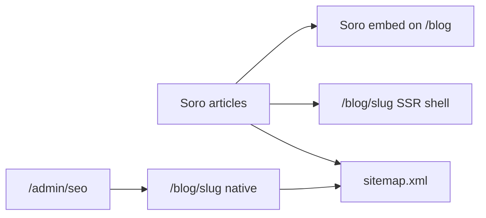

# Soro SEO + Hostora blog

How [Soro](https://trysoro.com/) appears on this Next.js site.

**Soro’s product path here is Embed only** (no webhook in their Connect UI). Hostora still owns `/admin/seo` and `/blog/[slug]` for first-party posts.

## What Soro does (and does not) do

| Expectation | Reality |
|-------------|---------|
| Publish long-tail articles on Hostora | **Yes** — embed + sitemap `/blog/{slug}` shells |
| Rank #1 for “restaurant POS” / “best hospitality software” in Google or ChatGPT | **No** — head terms are owned by Toast, Square, Lightspeed, etc. |
| Help ChatGPT/Gemini on brand or niche queries | **Gradually** — when pages are crawlable and specific |
| City long-tail (“restaurant software Birmingham”) | **Hostora `/locations` pages** — not Soro; see below |

Soro is a **content + discovery** pipeline. Ranking needs time, unique HTML, and the right keyword targets (article titles and city pages — not vanity “common word” AI tests).

**Thin body limitation:** Soro embed payload often has `content: null`. Hostora SSR shells give title/excerpt/image/JSON-LD; full body ranking improves when Soro exposes HTML or you mirror priority posts via `/admin/seo`.

## How it works

| Piece | Role |
|-------|------|
| `/blog` | Hostora hero + **Soro embed widget** + “Hostora notes” list |
| `/blog/[slug]` | Native Hostora articles **or** SSR shell for Soro articles (title, excerpt, image, JSON-LD) + embed |
| `/sitemap.xml` | Static pages + Hostora posts + **Soro article URLs** (`/blog/{slug}`) |
| `/admin/seo` | Hostora draft → approve → Blob publish |
| `POST /api/blog/publish` | Hostora tools only — **not** used by Soro embed |



## Why Google only saw ~10 pages before

Hostora’s sitemap listed static routes plus **native** Blob/seed posts only. Daily Soro calendar articles lived in the client embed (`content: null` in the script payload) and were **never** added as `/blog/{slug}` URLs. GSC “Discovered pages: 10” matched that sitemap exactly.

After this fix, `/sitemap.xml` includes each Soro slug as `https://www.hostorasoft.co.uk/blog/{slug}`, and those routes render a crawlable HTML shell.

**Limitation:** Full article body still loads inside Soro’s widget. Google gets discoverable URLs + title/excerpt/image; deep body ranking improves only if Soro exposes HTML or you mirror posts via Hostora `/admin/seo`.

## Google Search Console (www)

1. Add and verify the property **`https://www.hostorasoft.co.uk/`** (www), not only the apex.
2. Submit sitemap: `https://www.hostorasoft.co.uk/sitemap.xml`
3. Apex `https://hostorasoft.co.uk/` **308 redirects to www**. GSC “Page with redirect” on apex `/` and `/company` is expected — use the **www** property as primary.
4. After deploy, wait for Google to re-read the sitemap (days, not minutes). Indexed count will lag discovery.

## Connect Soro (embed)

1. Copy the embed ID from Soro → Settings → Connect → Embed (script URL ends with `/api/embed/<id>`).
2. Set on Vercel Production (and `.env.local`) then redeploy:

```bash
NEXT_PUBLIC_SORO_EMBED_ID=f4209b93-9cbd-4ae4-b286-ded667a515ef
```

Hostora falls back to that Production ID if the env is unset.

3. Open `https://www.hostorasoft.co.uk/blog` and confirm the widget mounts (`#soro-blog`).
4. In Soro, click **I’ve Added the Code**.
5. Prefer **approve then publish** inside Soro (avoid blind auto-publish).

### Limitations

- Article chrome and legacy deep links (`/blog?post=<slug>`) are still **Soro-controlled** for the widget UI.
- Prefer sharing **`/blog/{slug}`** (Hostora path) for indexing and stable canonicals.
- Hostora **cannot** brand-lint embed body HTML the way `/admin/seo` or `/api/blog/publish` does.
- Paste brand voice into Soro anyway (below).

### Share previews (Open Graph)

- **`/blog/{slug}`** (Soro or Hostora): server metadata + JSON-LD on the slug page.
- Legacy **`/blog?post=...`**: Hostora still sets `og:title` / `og:image` from Soro’s embed script (`SORO_ARTICLES`).

Embed metadata is revalidated about every ~2 minutes.

## Brand guardrails (paste into Soro brand voice)

**Voice:** Confident, operational, sparse. Product brand: Hostora. Vendor: K WAZIR LTD.

**Always link:** `/contact` (demo), `/product`, `/hardware` when relevant, `/solutions` for verticals.

**Denied / never claim:**
- Hostora is not hotel PMS (no rooms, front desk, housekeeping)
- Do not call the product “Fumari” (Fumari is a client venue only)
- No invented customer logos, revenue stats, or “#1” rankings
- No public price list or fake discounts
- English (UK) preferred

**Preferred topics:** restaurant POS UK, kitchen display / KDS, takeaway till, hotel F&B ops, food cart POS, on-prem Docker hospitality server, thermal printing by station.

Full machine rules (Hostora pipeline): [`content/seo/brand-rules.json`](../../content/seo/brand-rules.json).

## Hostora-owned path (controlled posts)

For articles with full body HTML, stable Hostora URLs and brand lint, use [seo-pipeline.md](./seo-pipeline.md) — `/admin/seo` or `npm run seo:draft` → review → publish. Those appear under **Hostora notes** on `/blog` and at `/blog/<slug>`.

## City pages (`/locations`)

Separate from Soro: Hostora ships **45 city pages** (15 UK + 15 Europe + 15 USA) under `/locations` and `/locations/{city}` for long-tail queries like “restaurant POS Birmingham”. Framed as **serving operators** in those cities (remote demos / pack installs) — not fake storefronts.

- Measure GSC impressions for `{city} + POS|KDS|hospitality software`
- Do **not** expect overnight #1 for “restaurant software near me” (Maps / Google Business Profile is a separate ops channel)
- Do **not** expect ChatGPT to crown Hostora for generic “best restaurant software” from city pages alone

## Hostora publish API (not used by Soro embed)

`POST https://www.hostorasoft.co.uk/api/blog/publish` remains for CLI/admin tooling (`BLOG_PUBLISH_SECRET`, Blob). Soro’s embed does not call it.

See also [seo-pipeline.md](./seo-pipeline.md).
